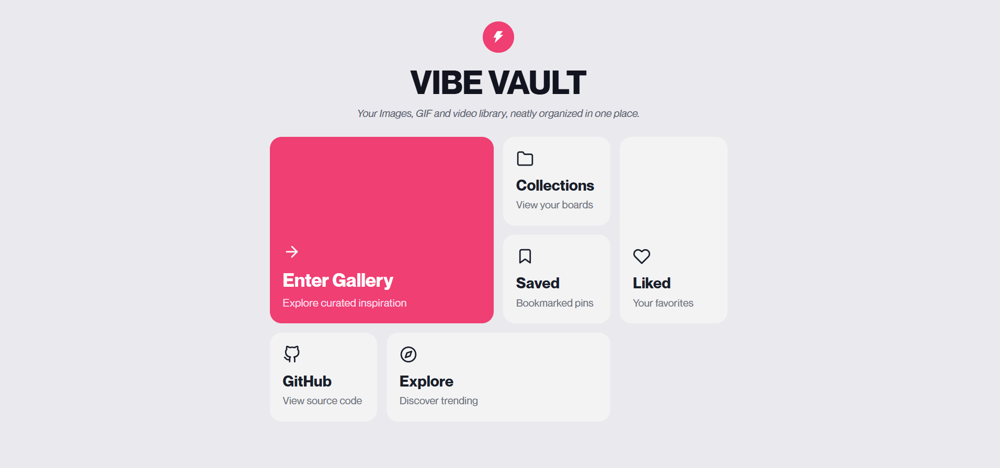
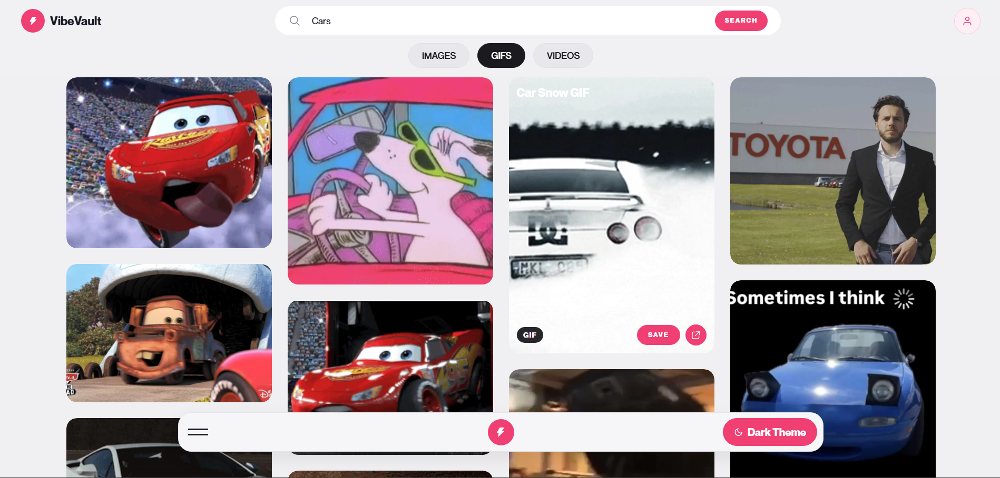
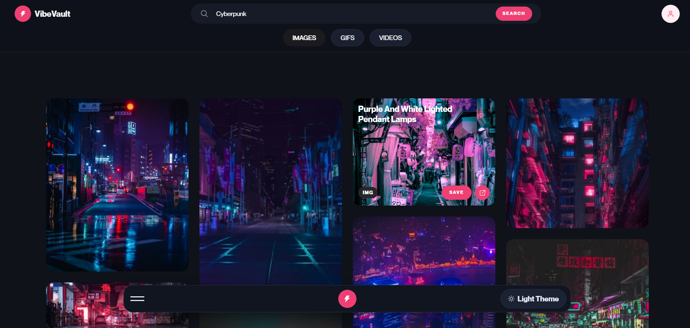
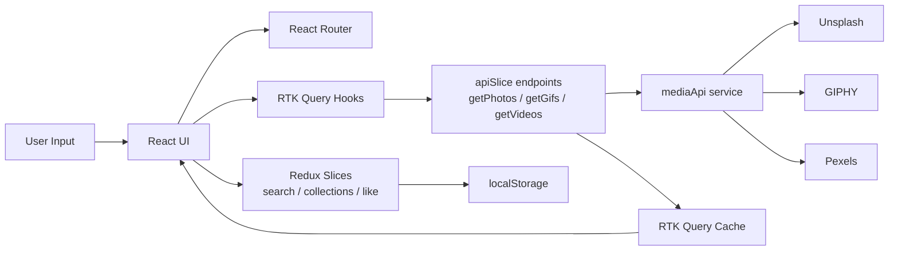

# VibeVault

VibeVault is a React-based media discovery app to search and browse **Images**, **GIFs**, and **Videos** from multiple providers (Unsplash, GIPHY, Pexels), save favorites, and manage personal collections.

## Live Product Focus

- Fast multi-source media browsing
- Saved collections + liked media persistence via localStorage
- Detailed media page with related content
- Theme-aware UI with custom loading states and smooth transitions
- Optimized fetching flow using **RTK Query**

## Tech Stack


## APIs Used

- Unsplash API (photos)
- GIPHY API (gifs)
- Pexels API (videos)

## Screenshots





## Architecture



## Development Flow (Start to Optimization)

1. **Project bootstrap**
- Vite + React app setup
- Routing and page shells (`Home`, `Browse`, `Collection`, `MediaDetail`)

2. **Core state management**
- Redux slices for search, liked items, and collections
- localStorage persistence for likes/collections

3. **Initial data fetching**
- Provider-specific fetch functions in `mediaApi.js`
- Query-driven rendering in browse page

4. **UI/UX improvements**
- Masonry/bento-style card layout
- Theme switching (light/dark)
- Skeleton loader system with blur-load + ring loader
- Smooth media fade-in transitions

5. **Optimization with RTK Query**
- Introduced `apiSlice` with separate endpoints:
  - `getPhotos`
  - `getGifs`
  - `getVideos`
- Replaced manual request effect in results flow with RTK Query hooks
- Added query caching and cleaner loading/error state handling

## Folder Structure

```text
ReduxProject/
├─ public/
├─ screenShots/
│  ├─ 1.png
│  ├─ 2.png
│  └─ 3.png
├─ src/
│  ├─ api/
│  │  └─ mediaApi.js
│  ├─ components/
│  │  ├─ Button.jsx
│  │  ├─ CardNav.jsx
│  │  ├─ ResultCard.jsx
│  │  ├─ ResultGrid.jsx
│  │  ├─ SearchBar.jsx
│  │  └─ Tabs.jsx
│  ├─ hooks/
│  │  ├─ handleRender.js
│  │  └─ useLenis.js
│  ├─ pages/
│  │  ├─ Browse.jsx
│  │  ├─ Collection.jsx
│  │  ├─ Home.jsx
│  │  └─ MediaDetail.jsx
│  ├─ redux/
│  │  ├─ features/
│  │  │  ├─ collectionSlice.js
│  │  │  ├─ likeSlice.js
│  │  │  └─ searchSlice.js
│  │  ├─ queries/
│  │  │  └─ apiSlice.js
│  │  └─ stores/
│  │     └─ store.js
│  ├─ App.jsx
│  ├─ index.css
│  └─ main.jsx
├─ .env
├─ package.json
└─ vite.config.js
```

## Environment Variables

Create a `.env` file in the root with:

```env
VITE_UNSPLASH_KEY=your_unsplash_access_key
VITE_GIPHY_KEY=your_giphy_api_key
VITE_PEXELS_KEY=your_pexels_api_key
```

## Local Setup

```bash
npm install
npm run dev
```

Open: `http://localhost:5173`

## Available Scripts

- `npm run dev` - start development server
- `npm run build` - production build
- `npm run preview` - preview production build locally
- `npm run lint` - run eslint

## Key Implementation Notes

- GIPHY requests are proxied through Vite dev server (`/giphy` in `vite.config.js`).
- Theme mode is stored in localStorage (`themeMode`).
- Likes and collections are persisted in localStorage.
- RTK Query middleware and reducer are registered in `src/redux/stores/store.js`.

## Roadmap

- Remove legacy unused fields in `searchSlice` now that RTK Query owns fetch state
- Add pagination/infinite scroll
- Add tests for reducers and query layer
- Improve accessibility and keyboard shortcuts

## Author

**Lucky Baliyan**
